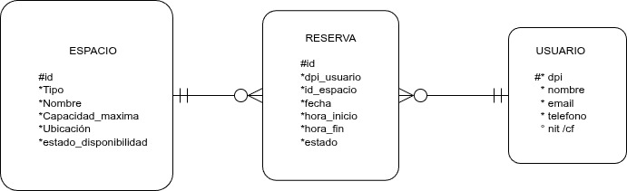
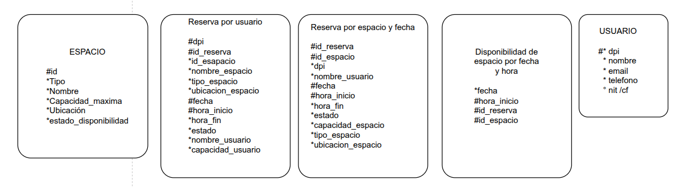

# BD2_2S2025_Grupo1_Proyecto1

**Sistemas de Bases de Datos 2 "A"**

Proyecto 1

Grupo 1

## Integrantes

| Carné     | Nombre                               |
| --------- | ------------------------------------ |
| 201807193 | Jonnathan Alexander Chocón Gómez     |
| 202044192 | Elian Angel Fernando Reyes Yac       |
| 202211834 | Carlos Fernando Enrique López García |

### Modelo Conceptual (Entidad-Relación)



### Modelo Lógico

se busca evitar joins y normalización excesiva



### Modelo Físico

| Tabla de la bd                                  | campos                                                                                                                                                | pk                                         |
| ----------------------------------------------- | ----------------------------------------------------------------------------------------------------------------------------------------------------- | ------------------------------------------ |
| **USUARIO**                                     | dpi (pk), nombre, email, telefono, NIT                                                                                                                | dpi                                        |
| **ESPACIO**                                     | id_espacio (pk), nombre, tipo, capacidad_max, ubicacion                                                                                               | id_espacio                                 |
| **RESERVAS POR USUARIO**                        | dpi, fecha, hora_inicio, id_reserva, id_espacio, nombre_espacio, tipo_espacio, ubicacion_espacio, hora_fin, estado, nombre_usuario, capacidad_usuario | dpi, fecha, hora_inicio, id_reserva        |
| **RESERVAS POR ESPACIO Y FECHA**                | id_espacio, fecha, hora_inicio, id_reserva,dpi, nombre_usuario, hora_fin, estado, tipo_espacio, capacidad_espacio, ubicacion_espacio                  | id_espacio, fecha, hora_inicio, id_reserva |
| **DISPONIBILIDAD DE ESPACIOS POR FECHA Y HORA** | fecha, hora_inicio, id_espacio, id_reserva                                                                                                            | fecha, hora_inicio, id_espacio, id_reserva |

#### Clúster de Cassandra en Docker (3 nodos, SimpleStrategy)

Se realiza un cluster local de Cassandra con 3 nodos usando Docker Compose para mejor control, se uso la replicación SimpleStrategy con factor de replicación de 2 para el keyspace​. cada dato se copiará en dos nodos distintos del clúster, mejorando la tolerancia a fallos

Se definieron 3 contenedores con Cassandra.el primer nodo funciona como seed para que los demás puedan unirse. Cada contenedor expone el puerto 9042 en el host con un puerto distinto para poder conectarnos desde la maquina anfitriona. También se habilita JMX en cada nodo (puerto 7199) para el monitoreo de los niodos.

comandos para ejecutar los contenedores

```bash
docker compose -f docker-compose.yml up
docker compose -f docker-compose-stats.yml up
```

##### Para cargar las tablas de la bd a los nodos se realiza con:

```bash
docker exec -it cassandra1 cqlsh -u cassandra -p cassandra -f /data-1/ddl.cql
```

#### Monitoreo con Prometheus

Utilizamos Prometheus en el cluster para recopilar métricas de los nodos de Cassandra, los datos son expuestos vía JMX en el puerto 7199. Traducimos de JMX a un endpoint en HTTP de métricas se crea un contenedor exportador por cada nodo Cassandra.

Se define un único job llamado "cassandra" con tres targets estáticos: los tres exportadores en sus puertos internos 8080. Cada 15 segundos Prometheus consultará cada exportador para obtener las métricas actuales.

web de Prometheus en http://localhost:9090.

#### Script de carga de datos en Python

Utilizamos un script de python llamado "carga.py" que genera datos aleatoriamente y los inserta en la base de datos. El script usa el controlador Python de Cassandra para conectarse al clúster y ejecutar las inserciones. Por temas de recursos y eficiencia se agrupa la escritura en una misma operacion.

comandos para ejecutar el script:

```bash
python3 -m venv .venv
source .venv/bin/activate

python3 -m pip install cassandra-driver
python3 -m pip install tqdm

python3 carga.py
```

#### Consultas

Utilizamos un script de python para mejorar las consultas, este script se llama "consultas.py", con el cual se puede realizar las siguientes consultas a la base de datos:

1. Consultar disponibilidad de un espacio en una fecha.
2. Ver historial de reservas de un usuario.
3. Obtener ocupación de espacios en un rango de fechas.

#### Tolerancia a fallos

**Simular la caída de un nodo:** Dado que configuramos factor de replicación de 2, cada dato está en dos nodos. Para simular la caida se puede detener un contenedor con lo siguiente:

```bash
docker-compose stop cassandra3
```

**Probar operaciones con diferentes niveles de consistencia:** Cassandra permite especificar el nivel de consistencia en cada operación de lectura/escritura:

- RF: Replication Factor
- CL: Consistency Level

- ONE: solo requiere que una réplica confirme la operación. Es el más rápido pero menos consistente
- QUORUM: requiere mayoría de réplicas, ambas réplicas deben confirmar el dato.
- ALL: requiere que todas las réplicas respondan.

- Con todos los nodos funcionando:

  - CL=ONE: se cumple con uno solo de los nodos, con baja latencia. La operación completará incluso si el otro nodo no esta disponible.
  - CL=QUORUM: requerirá comunicación con ambos nodos, lo cual añade algo de latencia. asegura que los datos leídos/escritos están en ambas copias.

- Con un nodo caído:

  - CL=ONE: Las lecturas/escrituras aún funcionarán si al menos una réplica (de las 2) está accesible. Si se consulta un dato cuya réplica activa está en cassandra1, éste lo retornará satisfactoriamente con CL=ONE.

- CL=QUORUM/ALL: se requiere la confirmación de ambas réplicas, como una esta caida no podrá lograrse consistencia. Cassandra en este caso dará un error de unavailable exception o timeout. Es decir, con un nodo fuera, las consultas con CL=QUORUM o ALL no alcanzarán el número requerido de respuestas (2) y fallara.

#### Pasos para la pruebas de consitencia:

1. Insertar un registro de prueba
2. Con todos los nodos arriba, en cqlsh o usando Python, intentar leer ese registro con consistencia QUORUM:

```sql
SELECT * FROM reservas_por_usuario WHERE dpi='DPI123542141' LIMIT 1;
```

Comando para volver a ejecuta el nodo detenido:

```bash
docker-compose start cassandra3
```
